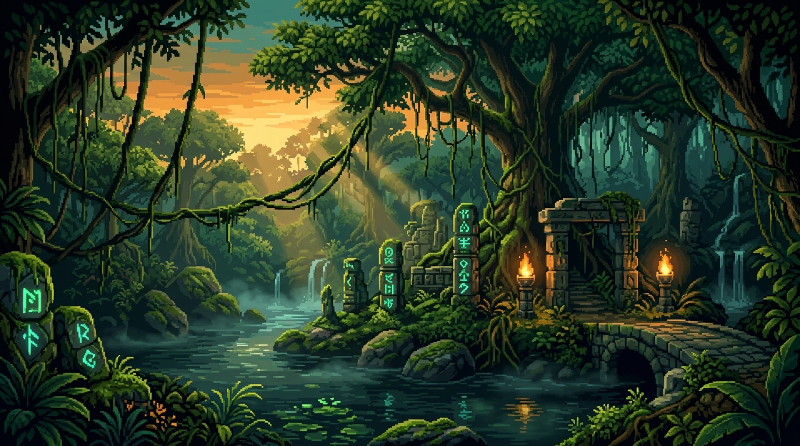
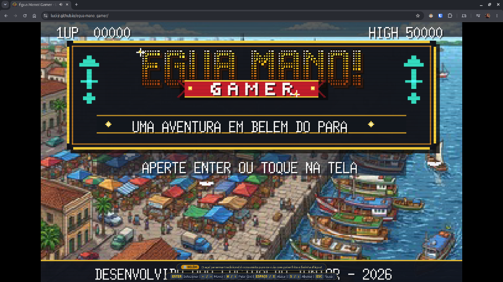
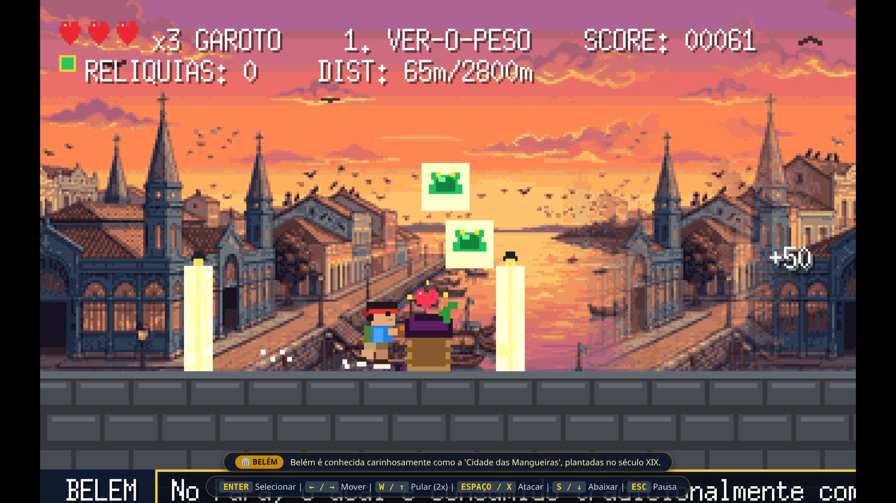
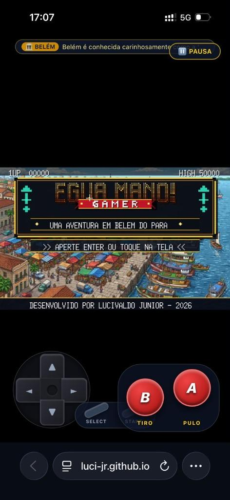
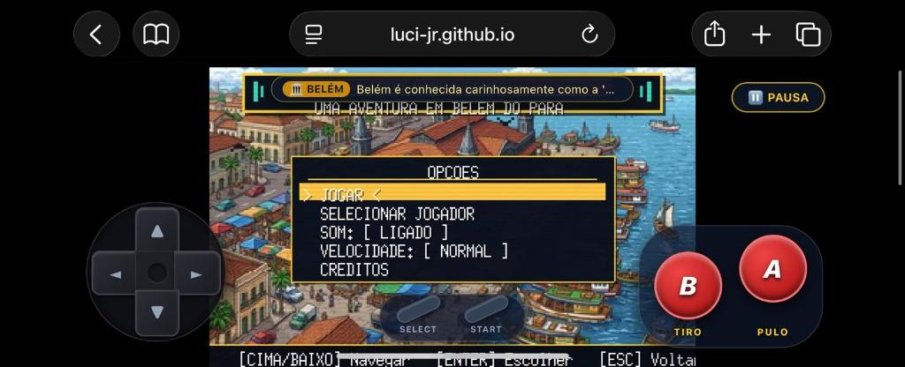
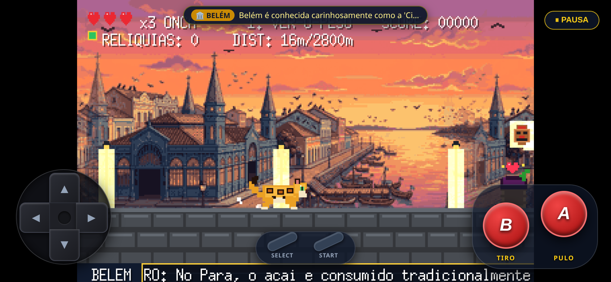
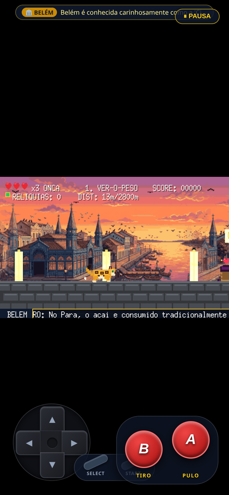
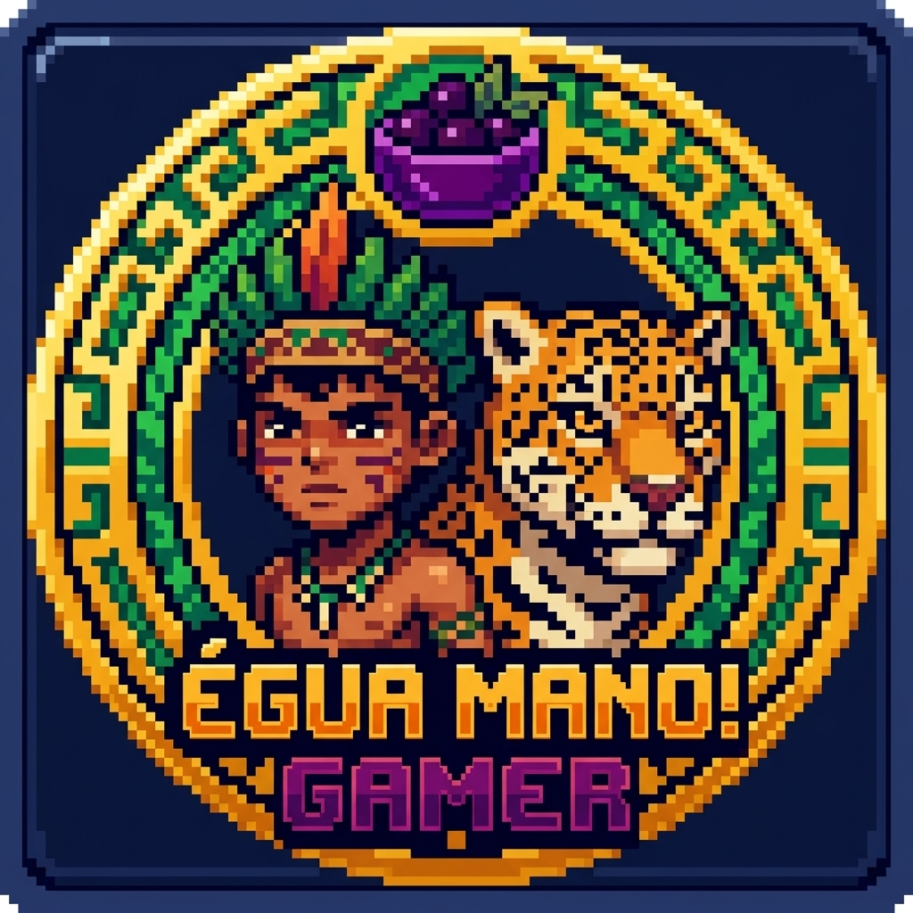
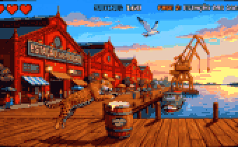

# 🏹 Égua Mano! Gamer: Uma Aventura em Belém do Pará


<div align="center">
  
</div>


<p align="center">
  <a href="https://github.com/luci-jr">
    
  </a>
  <a href="https://github.com/luci-jr/egua-mano_gamer">
    
  </a>
  <a href="https://luci-jr.github.io/egua-mano_gamer/">
    
  </a>
</p>

<p align="center">
  
</p>

> Um jogo de ação e aventura arcade retrô 16-bit construído 100% em **Go** com a engine **Ebitengine (v2)**, ambientado nos cartões-postais históricos, na rica culinária e na cultura vibrante de **Belém do Pará**.
>
> 🕹️ **Jogue agora online no navegador (WebAssembly):**  
> 👉 **[https://luci-jr.github.io/egua-mano_gamer/](https://luci-jr.github.io/egua-mano_gamer/)** *(Zero instalação, compatível com PC e Celular / Smartphone Android & iOS!)*  
>  
> 📜 **Documentação de Design & Engenharia:**  
> 👉 **[Consulte o Game Design Document (GDD) Oficial](docs/GDD.md)**

---

## 🌟 Sobre o Projeto

**Égua Mano! Gamer: Uma Aventura em Belém do Pará** foi concebido e desenvolvido pelo desenvolvedor [**Lucivaldo Junior**](https://github.com/luci-jr).

O projeto une rigor de engenharia de software em Go às melhores práticas arquiteturais do **Standard Go Project Layout** (`cmd/` e `internal/`), integrando:
* **Física de Plataforma Customizada:** Colisão AABB, salto com altura variável, pulo duplo (*double jump*), queda rápida (*fast drop*), aterrissagem no dorso de animais (*Pitfall ledge landing*) e refúgio em bancos de praça coloniais.
* **Pixel Art Retrô 8-Bit / 16-Bit:** Cenários panorâmicos fiéis aos pontos turísticos de Belém com scroll parallax contínuo e piso temático histórico.
* **Trilha Sonora Chiptune 8-Bit Autoral:** Autêntico **Carimbó Paraense 8-Bit** sintetizado matematicamente em tempo real (estilo Ricoh 2A03 / NES Arcade), 100% livre de direitos autorais.
* **Animações Culturais Únicas:** Cinemática dramática e cômica de perda de vida caindo na Baía do Guajará com splash aquático (*"Tchibum!"*), balões com gírias e expressões regionais paraenses, e tela náutica de transição a bordo do clássico barco regional "Popopó".

---

## 🐾 Dois Heróis da Amazônia: Garoto Curumim & Onça-Pintada

O jogador pode escolher seu herói a qualquer momento no menu de abertura ou na **Tela de Seleção de Personagem**:

| Herói | Perfil / Arquétipo | Ataque Padrão | Tiro Especial Carregado (*Charge Shot*) | Frase / Grito Marcante |
| :--- | :--- | :--- | :--- | :--- |
| 🏹 **Garoto Curumim** | **Aventureiro Destemido** | **Baladeira de Açaí:** Disparo veloz de caroços de açaí (frontal ou anti-aéreo para cima). | **Super Caroço Dourado:** Segure o ataque para canalizar energia e disparar um caroço gigante perfurante (+30 pts). | *"Bora lá maninho!"* / *"Tchibum na Baía do Guajará!"* |
| 🐆 **Onça-Pintada** | **Guardiã da Floresta** | **Rugido Sônico:** Emite ondas de choque acústicas que destroem predadores e abrem caminho. | **Mega Rugido Alfa:** Segure o ataque para soltar uma onda sônica massiva que perfura múltiplos alvos em fila. | *"RRRAUW! Rainha da Selva!"* / *"Tchibum! Onça no Guajará!"* |

---

## 🕹️ Tela de Abertura Oficial Arcade & Menus Compactos

A apresentação do jogo traz a autêntica nostalgia dos clássicos fliperamas dos anos 90:

1. **Vista Aérea 8-Bit do Ver-o-Peso:** A tela inicial exibe uma panorâmica em pixel art do emblemático **Mercado do Ver-o-Peso**, destacando as 4 torres de ferro inglesas, o cais de cantaria histórica, as barracas azuis dos feirantes e os barcos atracados na **Baía do Guajará**.
2. **Revoada em Tempo Real:** Urubus negros e garças brancas amazônicas sobrevoam continuamente o céu de Belém com animação de asas.
3. **Logotipo Arcade 3D em Ouro Maciço:** Letras garrafais em relevo de ouro imperial com extrusão 3D, bisel specular, feixe de luz dinâmico (*shimmer*), fita vermelha "GAMER" chanfrada e grafismos geométricos da cerâmica marajoara.
4. **Menu de Opções Compacto:** Sem poluição visual e com proporções harmoniosas:
   * **JOGAR:** Inicia a jornada por Belém.
   * **HERÓI: [ GAROTO / ONÇA ]:** Alterna o personagem jogável.
   * **SOM: [ LIGADO / MUDO ]:** Alterna a trilha sonora de carimbó chiptune e os efeitos sonoros procedurais.
   * **VELOCIDADE: [ LENTO / NORMAL / RAPIDO ]:** Ajuste simples e direto, sem números decimais confusos (`NORMAL` é o padrão oficial balanceado).
   * **CRÉDITOS:** Informações de autoria e tecnologia.

---

## 🎮 Controles do Jogo (Teclado & Celular)

| Teclado (PC) | Toque / Virtual Pad (Mobile) | Ação | Efeito no Jogo |
| :--- | :--- | :--- | :--- |
| `Seta Direita` ou `D` | Botão virtual **`►`** | **Avançar** | Caminha para a frente e avança o scroll da fase. |
| `Seta Esquerda` ou `A` | Botão virtual **`◄`** | **Recuar** | Retrocede suavemente para ganhar espaço de esquiva. |
| `W` ou `Seta Cima` | Botão **`▲ PULO`** | **Salto Variável** | Salto dinâmico com altura proporcional ao tempo pressionado. |
| `W` ou `↑` (2x no ar) | Tocar **`▲ PULO`** (2x) | **Pulo Duplo (*Double Jump*)** | Salto acrobático extra no ar (Curumim) ou bote felino (Onça). |
| `Espaço`, `X` ou `J` | Botão **`🎯 ATAQUE`** | **Ataque / Disparo** | Dispara baladeira de açaí (Curumim) ou rugido sônico (Onça). |
| Segurar `Espaço` (~0.7s) | Segurar **`🎯 ATAQUE`** | **Tiro Carregado (*Charge Shot*)** | Canaliza energia e dispara Super Caroço Dourado / Mega Rugido Alfa! |
| `W` ou `↑` (em pé) | Mirar para cima | **Mira Anti-Aérea** | Aponta o tiro na vertical para abater urubus e aves rasantes. |
| `Seta Baixo` ou `S` | Botão **`▼ BAIXO`** | **Abaixar / Rastejar** | Reduz a hitbox pela metade para desviar de ataques aéreos. |
| `Seta Baixo` (no ar) | Botão **`▼ BAIXO`** (no ar) | **Queda Rápida (*Fast Drop*)** | Interrompe o pulo e desce rapidamente ao solo seguro. |
| `Enter` / `Espaço` | Toque na tela | **Confirmar / Avançar** | Confirma opções de menu e salta telas de transição. |
| `Esc` | Botão **`⏸ PAUSA`** | **Pausar Aventura** | Abre o menu de pausa para ajuste de som, velocidade ou reinício. |

---

## 💖 Sistema de Vida, Cura do Açaí e Queda no Rio

* **3 Vidas & 3 Corações:** O aventureiro possui 3 vidas (`x3 VIDAS`). Cada vida suporta até 3 corações de dano.
* **Açaí não Machuca (Fonte de Energia Vital!):** Alinhado à tradição paraense, encostar nos Paneiros de Açaí no chão ou coletar a Tigela de Açaí (`RelicAcaiBowl`) **recupera 1 Coração** (`+1 CORACAO!`). Se os corações já estiverem cheios, concede o bônus **AÇAÍ POWER! (+100/+150 pts)**.
* **Subir em Obstáculos (*Ledge Landing*):** O herói pode aterrissar com segurança sobre o dorso do **Jacaré-Açu** e sobre os **Paneiros de Açaí**, usando-os como plataforma elevada para atacar ou desviar de outros perigos.
* **Banco de Praça Colonial (Refúgio Seguro):** Plataforma de madeira de lei e ferro trabalhado verde colonial. O banco NUNCA causa dano e serve de abrigo contra predadores terrestres.
* **Animação Dramática de Queda d'Água (*"Tchibum na Baía do Guajará!"*):**
  * Ao esgotar os corações, o herói é lançado em arco para trás caindo nas águas da baía.
  * Ao atingir a linha d'água, dispara som de splash aquático procedural, borrifos de água e ondas na superfície, com o popup `"-1 VIDA!"` e balões hilários:
    * Curumim: *"TCHIBUM NA BAIA DO GUAJARA!"*
    * Onça: *"TCHIBUM! ONCA NO GUAJARA!"*
  * Se restar vidas, ressurge caindo em segurança no cais com 3 corações cheios e invencibilidade temporária. Se zerar as 3 vidas, ocorre o Game Over: *"Levei o farelo mano, mancada!"*.

---

## 🏛️ Os Três Cartões-Postais de Belém em 8-Bit

A corrida se desenvolve ao longo de **2.800 metros por fase**, totalizando uma travessia completa pela capital paraense:

```text
[ FASE 1: Ver-o-Peso (2800m) ] ──> [ Barco Popopó ] ──> [ FASE 2: Estação das Docas (2800m) ] ──> [ Barco Popopó ] ──> [ FASE 3: Theatro da Paz (2800m) ]
```

### ⛵ Tela Náutica de Transição (O Barco Popopó)
Entre cada fase, o jogador navega pelas águas da Baía do Guajará a bordo do tradicional **Barco de Madeira Regional ("Popopó")** animado em pixel art, soltando fumacinha de escape (`"po-po-pó!"`) com barra de progresso náutica e curiosidades históricas de Belém.

---

## 📸 Galeria de Cenários & Modos de Jogo (PC e Celular)

### 💻 1. Execução no Navegador Web (PC / Desktop)
| Tela Inicial no Navegador Web (GitHub Pages) | Gameplay PC (Garoto Curumim) |
| :---: | :---: |
|  |  |
| *Jogo online rodando em WebAssembly no navegador Chrome/Edge* | *Corrida no cais do Ver-o-Peso com disparo de açaí* |

---

### 📱 2. Execução no Celular Mobile (iPhone iOS Safari & Android)
| iPhone iOS Vertical (Safari Portrait) | iPhone iOS Horizontal (Safari Landscape) |
| :---: | :---: |
|  |  |
| *Layout vertical responsivo com D-Pad e botões virtuas NES no iOS* | *Execução limpa em aba única do Safari no iPhone* |

| Android Horizontal (Landscape) | Android Vertical (Portrait) |
| :---: | :---: |
|  |  |
| *Controles Virtuais D-Pad e Botões NES em Tela Cheia* | *Modo Retrô Vertical com layout fluido e trivia paraense* |

---

### 🎨 3. Elementos Visuais & UI Retrô Ajustada
| Favicon Personalizado Arcade | Cenário 8-Bit (Estação das Docas) |
| :---: | :---: |
|  |  |
| *Ícone em Pixel Art com Curumim, Onça, Açaí e Ouro Marajoara* | *Galpões ingleses vermelhos, guindaste e pedras portuguesas* |

---

## 🎨 Ajustes Finais de Interface & Menu Retrô

* **Alinhamento do Subtítulo:** A linha inferior do brasão foi posicionada levemente abaixo do texto `UMA AVENTURA EM BELEM DO PARA` (`subY+17`), garantindo leitura limpa sem cortar as letras.
* **Menu de Escolha de Personagens:** Atributos dos cards do **Garoto Curumim** e da **Onça-Pintada** formatados com delimitação estrita para evitar sobreposição textual entre colunas.
* **Favicon Oficial do Projeto:** Adicionado ícone personalizado em pixel art nas dimensões 1:1 (`assets/favicon.png` / `favicon.ico`).

---

## 🏗️ Arquitetura do Software (Standard Go Layout)

```text
egua-mano_gamer/
├── cmd/
│   └── runner/
│       └── main.go              # Ponto de entrada oficial da aplicação
├── internal/                    # Módulos encapsulados da engine
│   ├── audio/
│   │   └── audio.go             # Síntese procedural chiptune de Carimbó 8-bit e splash d'água
│   ├── entities/
│   │   ├── player.go            # Interface unificada PlayerCharacter (Garoto Curumim & Onça)
│   │   ├── garoto.go            # Física, sprites, poses, passadas e baladeira do Garoto
│   │   ├── onca.go              # Física, sprites, bote felino e rugido sônico da Onça
│   │   ├── projectile.go        # Projéteis (sementes de açaí e super tiros energizados)
│   │   ├── obstacle.go          # Animais autônomos (Jacaré, Cobra, Urubu) e plataformas sólidas
│   │   └── relic.go             # Relíquias (Muiraquitã, Urna, Ouro e Cuia de Tacacá/Açaí)
│   ├── scenery/
│   │   └── ver_o_peso.go        # Scroll contínuo parallax e pisos históricos em pixel art
│   ├── ui/
│   │   ├── hud.go               # HUD, logotipo arcade 3D, menus compactos, splash e Tuxaua
│   │   ├── title_screen.jpg     # Embed oficial da imagem da tela inicial em 8-bit
│   │   └── title_test.go        # Testes automatizados de renderização sem pânico
│   └── game/
│       ├── game.go              # Loop principal, máquina de estados, velocidade e colisões
│       ├── input_desktop.go     # Captura de teclado/mouse para desktop
│       └── input_wasm.go        # Ponte de controles touch para WebAssembly no navegador
├── assets/                      # Recursos visuais oficiais do jogo
│   ├── title_screen.jpg         # Imagem 8-bit oficial da tela de abertura
│   ├── bg_fase1_8bit.png        # Cenário 8-bit da Fase 1 (Ver-o-Peso)
│   ├── bg_fase2_8bit.png        # Cenário 8-bit da Fase 2 (Estação das Docas)
│   └── bg_fase3_8bit.png        # Cenário 8-bit da Fase 3 (Theatro da Paz)
├── docs/                        # Deploy WebAssembly & Documentação Oficial
│   ├── GDD.md                   # Game Design Document (GDD) completo do jogo
│   ├── index.html               # Frontend responsivo para PC e Mobile
│   ├── game.wasm                # Binário executável Go compilado para WebAssembly
│   └── wasm_exec.js             # Runtime oficial de ponte Go-JS
├── main.go                      # Wrapper raiz para execução rápida
├── go.mod                       # Módulo Go: github.com/luci-jr/egua-mano_gamer
└── go.sum                       # Checksums de dependências
```

---

## 💻 Como Compilar e Jogar

### Pré-requisitos
* **Go 1.22+** instalado.

### 🌐 1. Jogar Online via Navegador (WebAssembly)
Acesse diretamente o GitHub Pages oficial do projeto:  
👉 **[https://luci-jr.github.io/egua-mano_gamer/](https://luci-jr.github.io/egua-mano_gamer/)**

Para testar a compilação WebAssembly localmente:
```bash
env GOOS=js GOARCH=wasm go build -o docs/game.wasm main.go
python3 -m http.server 8080 --directory docs
# Abra http://localhost:8080 no seu navegador
```

### 💻 2. Execução Nativa Desktop (Linux / macOS / Windows)
```bash
# Execução direta com go run
go run main.go

# Ou gerar o binário compilado de alta performance
go build -o egua-mano_gamer main.go
./egua-mano_gamer
```

---

## 👥 Autoria & Créditos

* **Desenvolvedor:** [**Lucivaldo Junior**](https://github.com/luci-jr)
  * 🐙 **GitHub:** [https://github.com/luci-jr](https://github.com/luci-jr) (`@luci-jr`)
  * 💻 **Repositório:** [https://github.com/luci-jr/egua-mano_gamer](https://github.com/luci-jr/egua-mano_gamer)
* **Linguagem:** Go (Golang 1.22+)
* **Engine Gráfica:** [Ebitengine (v2)](https://ebitengine.org/)
* **Trilha Sonora:** Carimbó Chiptune 8-Bit autoral sintetizado proceduralmente (livre de direitos autorais)
* **Gênero:** Corrida de Aventura & Plataforma Arcade Retrô
* **Inspiração:** *Pitfall: The Mayan Adventure* (1994)
* **Cenários & Temática:** Belém do Pará, Amazônia, Brasil 🇧🇷

<br>

<div align="center">
  
</div>


