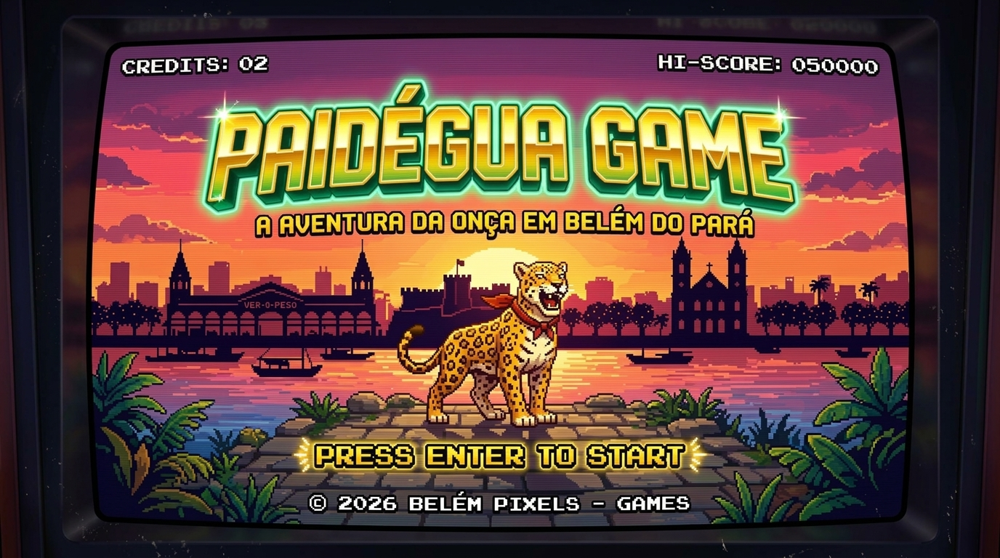
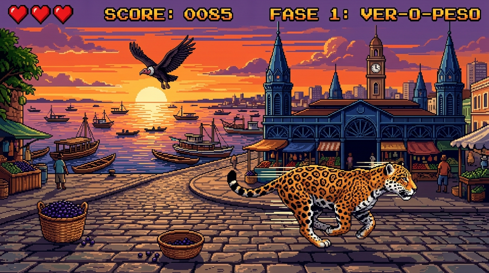
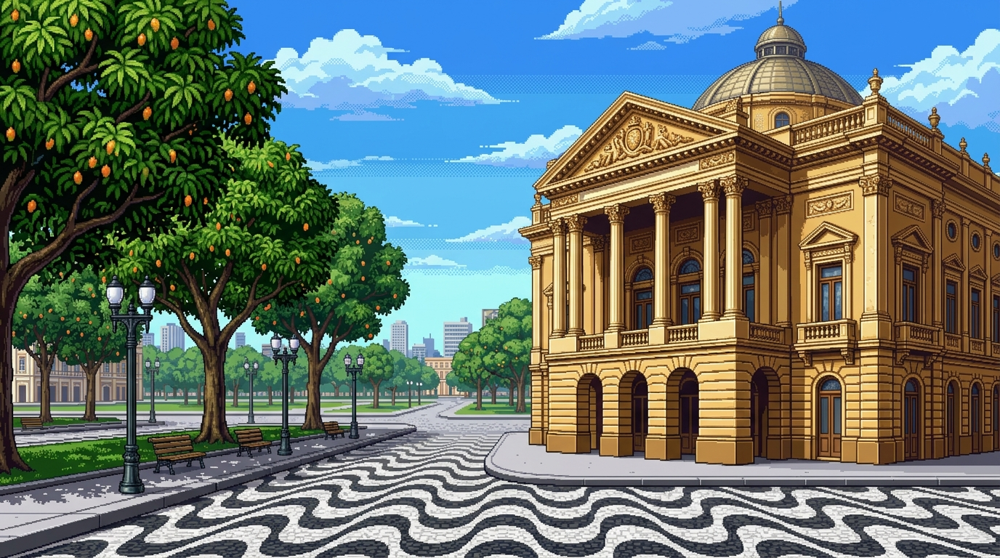

# 🐆 Paidégua Game: A Aventura da Onça em Belém do Pará



> Um jogo de ação arcade retrô-moderno construído 100% em **Go** com **Ebitengine (v2)**, ambientado nos cenários históricos e culturais de **Belém do Pará**.
>
> 🕹️ **Jogue agora online no navegador (WebAssembly):**  
> 👉 **[https://luci-jr.github.io/paidegua-game/](https://luci-jr.github.io/paidegua-game/)** *(Zero instalação, compatível com PC e Celular / Smartphone Android & iOS!)*

---

## 🌟 Sobre o Projeto

**Paidégua Game** foi concebido e desenvolvido por **Lucivaldo Junior** em co-criação com o **Nexus AI Ecosystem** (seu time de agentes autônomos de IA, sob liderança técnica de **Lucy - Tech Lead Sênior**). O projeto foi construído do zero com uma proposta didática e profissional: criar um jogo 2D fluido, arquitetado sob as melhores práticas do **Standard Go Project Layout** (`cmd/` e `internal/`), integrando síntese de áudio procedural sem dependência de arquivos externos e física refinada de plataforma.

O protagonista é uma **Onça-Pintada Brasileira** que percorre os cartões postais de Belém do Pará, esquivando-se de obstáculos típicos com saltos acrobáticos, pulo duplo, rugidos felinos e rastejo veloz, tudo ao som de um autêntico **Carimbó Chiptune 8-bit**.

---

## 🎮 Mecânicas & Jogabilidade (PC & Celular)

| Comando (Teclado) | Controle Touch (Celular) | Ação | Descrição |
| :--- | :--- | :--- | :--- |
| `Seta Direita` ou `D` | Botão virtual **`►`** | **Adiantar (Andar para Frente)** | A onça avança na tela horizontalmente com limite seguro. |
| `Seta Esquerda` ou `A` | Botão virtual **`◄`** | **Recuar (Andar para Trás)** | A onça recua na tela horizontalmente para ganhar tempo. |
| `Espaço` / `Cima` / `W` | Botão virtual **`▲ PULO`** | **Pulo com Rugido** | Salta soltando rugido felino gutural com altura variável. |
| `Espaço / Cima` (2x) | Tocar **`▲ PULO`** (2x) | **Pulo Duplo (*Double Jump*)** | Impulso no ar com rugido duplo e faíscas. |
| `Seta Baixo` ou `S` | Botão virtual **`▼ BAIXO`** | **Abaixar / Rastejar** | Reduz o hitbox pela metade (passa sob pássaros). |
| `Seta Baixo` (no ar) | Botão **`▼ BAIXO`** (no ar) | **Queda Rápida (*Fast Drop*)** | Acelera a descida ao solo. |
| Clique na Janela / Toque | **Toque na Tela / Clique** | **Iniciar o Jogo** | O jogo aguarda na tela de São Brás e só inicia após um clique explícito na janela. |
| `Esc` | Botão virtual **`⏸ PAUSA`** | **Menu de Pausa Interativo** | Abre o menu com som, reinício e créditos. |
| `C` | Opção do Menu | **Ver Créditos** | Informações sobre desenvolvedor, IA, Go e música. |
| `R` ou Clique | Toque na tela | **Recomeçar Rápido** | Reinicia imediatamente na tela de conclusão ou Game Over. |
| **Ao sofrer dano (vidas restantes)** | Automático | **Hitstop & "Égua mano!..."** | Congelamento suave (*hitstop*), som regional e balão de fala da onça. |
| **Ao morrer (perder todas as vidas)** | Automático | **"Levei o farelo mano, mancada!"** | A onça solta o clássico balão paraense de Game Over na pista. |

---

## 💖 Sistema de Vidas & Corações (3 Vidas x 3 Erros)

O jogo possui um sistema balanceado de sobrevivência arcade retrô:
* **3 Vidas Totais (`x3 VIDAS` no HUD):** A onça possui 3 vidas no total.
* **3 Corações por Vida:** Os 3 corações em pixel art no topo da tela representam a resistência da vida atual.
* **Mecânica de Dano:**
  * Cada colisão com obstáculo desconta **1 coração** (a onça grita `"EGUA MANO!..."` com congelamento suave de tela e invencibilidade temporária).
  * Ao perder os **3 corações** da vida corrente, o jogador perde **1 vida**, e os **3 corações são recarregados** para a nova vida (`x2 VIDAS`, depois `x1 VIDAS`).
  * Ao esgotar todas as 3 vidas (`x0 VIDAS`), a onça tomba e dispara o clássico balão paraense: `"Levei o farelo mano, mancada!"` na tela de Game Over.

---

## 🏛️ As 3 Fases Ilustradas de Belém do Pará

O jogo conta com fluxo dinâmico de múltiplos obstáculos na tela simultaneamente com espaçamento inteligente (`ObstacleManager`), permitindo conquistar pelo menos **1000 pontos por fase**:

```text
[ FASE 1: Ver-o-Peso (1000 pts) ] ──> [ FASE 2: Estação das Docas (2000 pts) ] ──> [ FASE 3: Theatro da Paz (3000 pts) ]
```

### 🐟 1. Mercado do Ver-o-Peso (0 a 1000 pontos)


* **Cenário:** O crepúsculo alaranjado sobre a **Baía do Guajará**, barcos de madeira navegando, **Mercado de Ferro com cúpulas neogóticas** e calçadão de pedras.
* **Obstáculos Temáticos:**
  * 🧺 **Paneiro de Açaí:** Cesto tradicional de palha trançada com açaí roxo *(Pular)*.
  * 🦅 **Urubu do Ver-o-Peso:** Voando a meia altura *(Abaixar / Rastejar)*.
  * 🐊 **Jacaré-Açu da Amazônia:** Réptil com bocarra aberta e dentes brancos afiados *(Pular)*.
  * 🐍 **Cobra-Coral da Floresta:** Serpente rápida ondulando no solo com língua bífida *(Pular)*.

---

### ⚓ 2. Estação das Docas (1001 a 2000 pontos)


* **Cenário:** Os emblemáticos **galpões ingleses de ferro vermelho**, os imponentes **guindastes portuários amarelos** e o deck de madeira à beira da baía.
* **Obstáculos Temáticos:**
  * 🐊 **Jacaré no Cais das Docas:** O temível réptil que subiu da Baía do Guajará *(Pular)*.
  * 🐍 **Cobra-Coral Amazônica:** Serpente venenosa rastejante com anéis vibrantes *(Pular)*.
  * 🕊️ **Gaivota da Baía:** Pássaro rasante com asas animadas *(Abaixar / Rastejar)*.
  * 🧺 **Paneiro de Açaí:** Cesto com frutos amazônicos *(Pular)*.

---

### 🎭 3. Theatro da Paz & Mangueiras (2001 a 3000 pontos - Vitória Final!)


* **Cenário:** Fachada neoclássica do **Theatro da Paz**, **Mangueiras centenárias de Belém** com mangas douradas e calçada de pedras portuguesas.
* **Obstáculos Temáticos:**
  * 🥭 **Cesto de Castanhas e Frutos:** Cesto artesanal com castanhas e cupuaçus *(Pular)*.
  * 🦜 **Arara / Maritaca Amazônica:** Ave verde e amarela sobrevoando veloz *(Abaixar / Rastejar)*.
  * 🐊 **Jacaré-Açu:** Desafio reptiliano nos arredores da Praça da República *(Pular)*.
  * 🐍 **Cobra da Amazônia:** Serpente rasteira em alta velocidade *(Pular)*.

---

## 🏛️ Rodapé com Curiosidades Culturais de Belém do Pará

Durante o jogo e nas telas de apresentação, o rodapé exibe um letreiro digital contínuo com fatos históricos, culturais e ambientais sobre Belém:
* **Fase 1 (Ver-o-Peso):** Fatos sobre a fundação da feira livre em 1627, a tradição do açaí puro com peixe frito, o tacacá com jambu adormecedor e a fauna dos rios amazônicos.
* **Fase 2 (Estação das Docas):** Fatos sobre a restauração dos armazéns de ferro ingleses de 1897, os guindastes históricos, o ecoturismo na Ilha do Combú e a chuva da tarde.
* **Fase 3 (Theatro da Paz):** Fatos sobre a Belle Époque amazônica, o Theatro da Paz (1878), o Círio de Nazaré, a história da "Cidade das Mangueiras" e a gíria "Paidégua".
* **Tela de Abertura (Mercado de São Brás):** Curiosidades sobre a inauguração em 1911 pelo arquiteto George Saint-Clair, arquitetura de ferro e sua grande revitalização.

---

## 📸 Galeria Visual do Jogo

| Tela Inicial / Arcade | Mercado do Ver-o-Peso (Fase 1) |
| :---: | :---: |
|  |  |

| Estação das Docas (Fase 2) | Theatro da Paz (Fase 3) |
| :---: | :---: |
|  |  |

---

## 🏗️ Arquitetura do Software (Standard Go Layout)

O projeto foi estruturado seguindo rigorosamente os padrões corporativos de engenharia de software em Go:

```text
paidegua-game/
├── cmd/
│   └── runner/
│       └── main.go              # Entrypoint oficial da aplicação (< 15 linhas)
├── internal/                    # Módulos privados protegidos pelo compilador Go
│   ├── audio/
│   │   └── audio.go             # Sintetizador procedural de Carimbó BGM e Rugido Felino
│   ├── entities/
│   │   ├── onca.go              # Anatomia, ciclo de galope em 4 fases, partículas e física
│   │   └── obstacle.go          # Gerador procedural de obstáculos terrestres e aéreos
│   ├── scenery/
│   │   └── ver_o_peso.go        # Renderização em camadas e paralaxe dos 3 pontos turísticos
│   ├── ui/
│   │   └── hud.go               # HUD de corações em pixel art, score, telas de pausa e vitória
│   └── game/
│       └── game.go              # Game Loop (Update, Draw, Layout do Ebitengine)
├── assets/
│   ├── menu_inicial.jpg         # Screenshot da Tela Inicial Arcade
│   ├── fase1_ver_o_peso.jpg     # Screenshot do Mercado do Ver-o-Peso
│   ├── fase2_estacao_das_docas.jpg # Screenshot da Estação das Docas
│   ├── fase3_theatro_da_paz.jpg # Screenshot do Theatro da Paz
│   ├── gameplay.jpg             # Mockup visual do jogo
│   └── ver_o_peso_bg.jpg        # Background panorâmico em pixel art
├── GUIA_APRENDIZADO.md          # Guia técnico passo a passo completo
├── main.go                      # Wrapper na raiz para execução rápida
├── go.mod                       # Módulo Go (github.com/luci-jr/paidegua-game)
└── go.sum                       # Checksums das bibliotecas
```

### Por que essa estrutura?
* **Encapsulamento com `internal/`:** O compilador do Go proíbe qualquer importação externa de código localizado em `internal/`, garantindo que regras de negócio não vazem.
* **`cmd/` Enxuto (*Thin Main*):** O ponto de entrada apenas inicializa as configurações e dispara o loop, sem acoplamento de lógica.

---

## 🎵 Síntese de Áudio Procedural (Zero Arquivos Externos)

Ao invés de carregar arquivos `.wav` ou `.mp3` pesados, todos os efeitos e músicas são **sintetizados matematicamente em tempo real** diretamente na memória:

1. **Trilha de Apresentação de São Brás (Intro BGM):**
   * Melodia aconchegante e nostálgica de 64 passos inspirada na Guitarrada Paraense e na brisa de Belém.
   * Síntese com harmônicos de primeira e segunda oitava, vibrato sutil, contrabaixo encorpado e maracas procedurais de carimbó.
   * Toca em segundo plano na tela de abertura do Mercado de São Brás antes de iniciar a corrida.
2. **Trilha de Carimbó da Corrida (Gameplay BGM):**
   * Curimbó grave (82Hz), repiques sincopados e marimba procedural em loop contínuo via `audio.NewInfiniteLoop`.
   * Mixagem alegre, enérgica e festiva ao estilo dos ritmos paraenses durante toda a corrida.
3. **Rugido Felino da Onça (*Feline Roar*):**
   * Sintetizado com frequência base grave (85Hz a 110Hz) modulada por tremolo de garganta (38Hz) e respiração felina.
4. **Impacto e Danos:**
   * Punch grave com decaimento exponencial suave.

---

## 💻 Como Rodar o Projeto

### Pré-requisitos
* **Go** versão 1.22 ou superior instalada.

### 🌐 1. Jogar Online no Navegador (WebAssembly)
Basta abrir o link oficial do jogo hospedado no GitHub Pages:
👉 **[https://luci-jr.github.io/paidegua-game/](https://luci-jr.github.io/paidegua-game/)**

Para testar a versão WebAssembly localmente:
```bash
GOOS=js GOARCH=wasm go build -o docs/game.wasm ./cmd/runner
python3 -m http.server 8080 --directory docs
# Abra http://localhost:8080 no seu navegador
```

### 💻 2. Execução Nativa Desktop (Linux / Mac / Windows)
Abra o terminal na pasta do projeto e rode:

```bash
# Opção A: Execução direta
go run ./cmd/runner

# Opção B: Compilar o binário autônomo
go build -o paidegua-game ./cmd/runner
./paidegua-game
```

---

## 🧠 Conceitos de Engenharia de Software Aplicados

* **State Machine & Physics:** Gravidade parabólica, Coyote Time, Jump Buffering e corte de velocidade vertical no release do botão.
* **AABB Collision Detection:** Algoritmo matemático de sobreposição de retângulos alinhados aos eixos com caixas de colisão dinâmicas.
* **Particle System:** Sistema enxuto de partículas com reciclagem de memória para poeira de aterrissagem e rastejo.
* **Ebitengine Loop:** Separação estrita entre simulação física determinística a 60 ticks por segundo (`Update`) e renderização em camadas (`Draw`).

---

## 👥 Autoria & Créditos

* **Desenvolvedor:** **Lucivaldo Junior** (Luci Junior)
* **Co-criação & Squad de IA:** **Nexus AI Ecosystem** — Sistema autônomo de múltiplos agentes de Inteligência Artificial idealizado e desenvolvido por **Lucivaldo Junior**, atuando sob a liderança técnica e arquitetura de **Lucy (Tech Lead & Arquiteta do Ecossistema)**.
* **Linguagem:** Go (Golang 1.22+)
* **Game Engine:** [Ebitengine (v2)](https://ebitengine.org/)
* **Síntese de Áudio:** Síntese procedural em tempo real (Carimbó BGM e Rugido Felino).
* **Temática Cultural:** Belém do Pará, Amazônia, Brasil.
