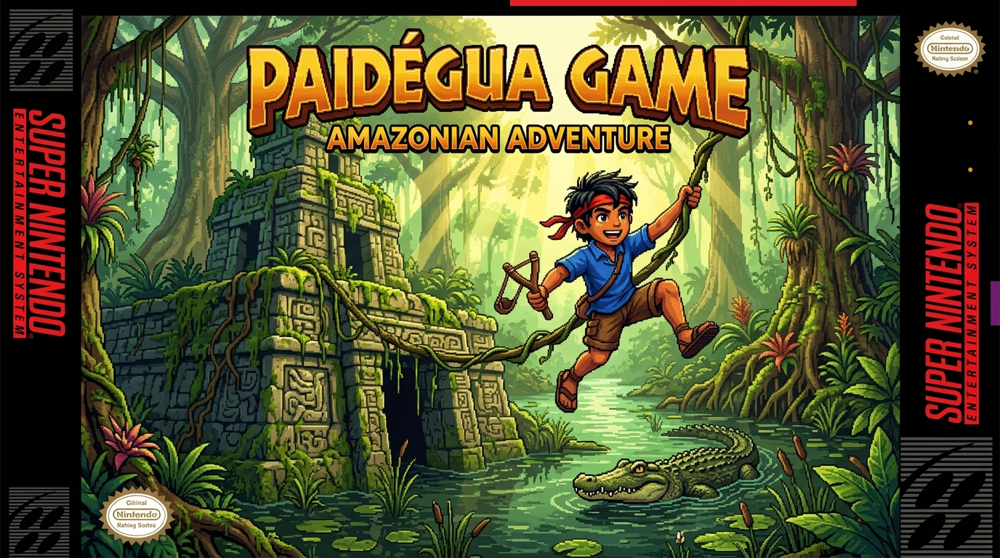

# 🏹 PaiD'egua Runner - Uma Aventura em Belém do Pará



> Um jogo de ação e aventura arcade retrô construído 100% em **Go** com **Ebitengine (v2)**, ambientado nas paisagens, cartões-postais e na cultura vibrante de **Belém do Pará**.
>
> 🕹️ **Jogue agora online no navegador (WebAssembly):**  
> 👉 **[https://luci-jr.github.io/paidegua-runner/](https://luci-jr.github.io/paidegua-runner/)** *(Zero instalação, compatível com PC e Celular / Smartphone Android & iOS!)*

---

## 🌟 Sobre o Projeto

**PaiD'egua Runner** foi concebido e desenvolvido por **Lucivaldo Junior** em co-criação com o **Nexus AI Ecosystem** (seu time de agentes autônomos de IA, sob liderança técnica de **Lucy - Tech Lead Sênior**). O projeto alia rigor de engenharia de software em Go às melhores práticas do **Standard Go Project Layout** (`cmd/` e `internal/`), integrando síntese de áudio procedural, decodificação MP3 nativa e física refinada de corrida de plataforma 16-bit.

O protagonista é um corajoso **Garoto Aventureiro Paraense**, equipado com sua clássica **baladeira de madeira (estilingue que dispara sementes de açaí)** e faixa vermelha retrô, desbravando a cidade e os cartões-postais históricos de Belém do Pará ao som de um autêntico e vibrante **Carimbó Paraense 8-Bit Chiptune** autoral (NES/Arcade style, 100% livre de direitos autorais).

---

## 🐾 Escolha de Protagonista: Garoto Curumim ou Onça-Pintada!

Na nova versão inspirada em clássicos arcade dos anos 90, o jogador pode **escolher livremente seu herói da Amazônia** tanto no menu inicial quanto na **Tela Dedicada de Seleção de Personagem**:

| Herói | Classe / Perfil | Ataque Especial | Habilidade & Estilo | Grito / Frase Marcante |
| :--- | :--- | :--- | :--- | :--- |
| 🏹 **Garoto Curumim** | **Aventureiro da Selva** | **Baladeira de Açaí:** Disparo balístico de sementes velozes (anti-aéreo para cima ou frontal). | Pulo Duplo ágil no ar, escalada acrobática no cipó pendular e rastejo. | *"Bora lá maninho!"* / Grito de selva estilo Tarzan ao soltar o cipó. |
| 🐆 **Onça-Pintada** | **Predadora Guardiã** | **Rugido Sônico:** Emite ondas de choque acústicas douradas concêntricas que varrem inimigos. | Salto felino feroz, passadas mais rápidas (`2.4x`), bote ágil e garras no cipó. | *"RRRAUW! Rainha da Selva!"* / Rugido trovejante ao soltar o cipó. |

---

## 🕹️ Tela de Abertura Cinematográfica & Menu Interativo (VER. 2.4.0)

O jogo inicia com uma **apresentação de abertura arcade clássica** (estilo *Pitfall / Super Metroid / Contra*):
* **Fundo Panorâmico de Belém:** Mercado do Ver-o-Peso e a Baía do Guajará ao entardecer com reflexos dourados na água.
* **Revoada em Tempo Real:** Urubus negros e garças brancas amazônicas voando continuamente pelo céu em pixel art animado.
* **Abertura Limpa:** O menu de opções e configurações surge apenas após o jogador pressionar **Enter** ou tocar na tela (podendo retornar à capa limpa a qualquer momento com `ESC`).

Tanto no **Menu de Aventura** quanto no **Menu de Pausa (`Esc`)**, o jogador conta com um painel completo de controle:

* **▶ INICIAR AVENTURA:** Abre a **Tela de Seleção de Personagem** para escolher entre Garoto Curumim ou Onça-Pintada.
* **🐾 HERÓI: [ GAROTO CURUMIM / ONÇA-PINTADA ]:** Alterna o herói ativo diretamente com `Esquerda/Direita` ou clicando no menu.
* **🔊 SOM: [ LIGADO / MUDO ]:** Alterna instantaneamente a trilha de carimbó e todos os efeitos sonoros procedurais.
* **⚡ VELOCIDADE DO JOGO:** Calibre o ritmo da ação em tempo real com 4 perfis distintos:
  * `0.6x CALMO`: Ritmo cadenciado para treino e exploração cuidadosa.
  * `0.8x NORMAL`: **Velocidade oficial padrão**, perfeitamente equilibrada para a travessia e esquivas.
  * `1.0x RAPIDO`: Ação dinâmica e reflexos apurados.
  * `1.3x TURBO`: Desafio extremo estilo arcade frenético!
* **★ VER CRÉDITOS:** Apresenta a autoria, stack técnica (Go + Ebitengine v2) e co-criação com IA.

---

## 🎮 Mecânicas & Jogabilidade (PC & Celular)

| Comando (Teclado) | Controle Touch (Celular) | Ação | Descrição |
| :--- | :--- | :--- | :--- |
| `Enter` | Toque na tela / botão | **Confirmar / Escolher** | Confirma seleções no menu e na Tela de Escolha de Personagem. |
| `Seta Direita` ou `D` | Botão virtual **`►`** | **Avançar** | O aventureiro se desloca para a direita na tela. |
| `Seta Esquerda` ou `A` | Botão virtual **`◄`** | **Recuar** | Recua na tela horizontalmente para ganhar espaço de mira. |
| `W` ou `↑` | Botão virtual **`▲ PULO`** | **Salto com Altura Variável** | Salta com impulso físico parabólico e poeira nos pés. |
| `W` ou `↑` (2x) | Tocar **`▲ PULO`** (2x) | **Pulo Duplo (*Double Jump*)** | Segundo impulso acrobático no ar (Curumim) ou bote feroz no ar (Onça). |
| `Espaço`, `X` ou `J` | Botão virtual **`🎯 ATAQUE`** | **Ataque do Herói** | Baladeira de sementes de açaí (Curumim) ou Rugido Sônico concêntrico (Onça). |
| `W` ou `↑` (em pé) | Mirar para cima | **Mira Anti-Aérea** | Aponta o disparo verticalmente para abater aves no céu. |
| `Seta Baixo` ou `S` | Botão virtual **`▼ BAIXO`** | **Abaixar / Rastejar** | Reduz a hitbox pela metade para esquivar de aves rasantes. |
| `Seta Baixo` (no ar) | Botão **`▼ BAIXO`** (no ar) | **Queda Rápida (*Fast Drop*)** | Corta o arco do pulo e cai velozmente no chão. |
| `Esc` | Botão virtual **`⏸ PAUSA`** | **Menu de Pausa Interativo** | Pausa o jogo e permite ajustar som, velocidade e opções. |
| `C` | Opção do Menu | **Ver Créditos** | Detalhes sobre o desenvolvedor, Nexus AI, Go e áudio. |
| `R` | Toque na tela | **Recomeçar Rápido** | Reinicia imediatamente na tela de conclusão ou Game Over. |
| **Ao sofrer dano** | Automático | **Hitstop & Regionalismo** | Congelamento suave de tela (*hitstop*), som regional e balão de fala. |

---

## 💖 Sistema de Sobrevivência (3 Vidas x 3 Erros)

O jogo possui um sistema balanceado de sobrevivência arcade retrô:
* **3 Vidas Totais (`x3 VIDAS` no HUD):** O herói começa com 3 vidas completas.
* **3 Corações por Vida:** 3 corações vermelhos em pixel art medem a resistência da vida atual.
* **Mecânica de Dano e Invencibilidade:**
  * Cada colisão com inimigo desconta **1 coração** (o aventureiro solta balão regional com congelamento suave de tela e *i-frames* piscantes).
  * Ao esgotar os **3 corações**, perde **1 vida**, e os **3 corações são recarregados** para a nova vida (`x2 VIDAS`, depois `x1 VIDAS`).
  * Ao perder as 3 vidas (`x0 VIDAS`), ocorre o Game Over com a expressão paraense: `"Levei o farelo mano, mancada!"`.
* **Calor Amazônico em Pista:**
  * Periodicamente na corrida, o personagem sente o mormaço de Belém e solta o balão: `"Égua da lua, um sol pra cada um!"` com gotículas de suor em pixel art.
* **Saudação do Tuxaua Indígena:**
  * Ao concluir cada fase, o **Guerreiro Indígena Tuxaua** surge em destaque em pixel art com cocar majestoso de penas de arara e saúda o herói com bênçãos da floresta!

---

## 🏛️ As 3 Fases de Belém do Pará

```text
[ FASE 1: Ver-o-Peso (2800 m) ] ──> [ Popopó pela Baía ] ──> [ FASE 2: Estação das Docas (2800 m) ] ──> [ Popopó pela Baía ] ──> [ FASE 3: Theatro da Paz (2800 m - Vitória!) ]
```

### ⛵ Tela Náutica de Transição Cultural (O Barco Popopó)
Entre cada fase, o jogador navega pelas águas da Baía do Guajará a bordo do tradicional **Barco de Madeira Regional ("Popopó")**, com fumaça pixel art animada, horizonte de Belém ao entardecer e barra de carregamento com curiosidades e rotas culturais da cidade!

### 🐟 1. Mercado do Ver-o-Peso (0 a 2800 metros)

* **Cenário:** O crepúsculo sobre a **Baía do Guajará**, barcos tradicionais, **Mercado de Ferro com cúpulas neogóticas**, postes coloniais de iluminação e calçadão histórico.
* **Inimigos & Desafios:**
  * 🧺 **Paneiro de Açaí:** Cesto de palha com açaí fresco *(Pular ou Destruir com a Baladeira)*.
  * 🦅 **Urubu do Ver-o-Peso:** Voando a meia altura *(Abaixar ou Disparar para Cima)*.
  * 🐊 **Jacaré-Açu da Amazônia:** Bocarra aberta e dentes afiados *(Pular ou Abater com Baladeira)*.
  * 🐍 **Cobra-Coral da Floresta:** Serpente rápida rastejando no solo *(Pular ou Abater)*.

---

### ⚓ 2. Estação das Docas (0 a 2800 metros)

* **Cenário:** Os emblemáticos **galpões ingleses de ferro vermelho**, os imponentes **guindastes portuários amarelos** e o deck de madeira à beira da baía.
* **Inimigos & Desafios:**
  * 🐊 **Jacaré no Cais das Docas:** O temível predador que subiu da Baía do Guajará *(Pular ou Destruir)*.
  * 🐍 **Cobra-Coral Amazônica:** Serpente venenosa rastejante com anéis vibrantes *(Pular ou Abater)*.
  * 🕊️ **Gaivota da Baía:** Pássaro rasante com asas animadas *(Abaixar ou Disparar)*.
  * 🧺 **Paneiro de Açaí:** Cesto com frutos amazônicos *(Pular ou Destruir)*.

---

### 🎭 3. Theatro da Paz & Mangueiras (0 a 2800 metros - Vitória Final!)

* **Cenário:** Fachada neoclássica do **Theatro da Paz**, **Mangueiras centenárias de Belém** com mangas douradas e calçada de pedras portuguesas.
* **Inimigos & Desafios:**
  * 🥭 **Cesto de Castanhas e Frutos:** Cesto artesanal com castanhas e cupuaçus *(Pular ou Destruir)*.
  * 🦜 **Arara / Maritaca Amazônica:** Ave verde e amarela sobrevoando veloz *(Abaixar ou Disparar)*.
  * 🐊 **Jacaré-Açu:** Desafio reptiliano nos arredores da Praça da República *(Pular ou Destruir)*.
  * 🐍 **Cobra da Amazônia:** Serpente rasteira em alta velocidade *(Pular ou Destruir)*.

---

## 🏛️ Rodapé com Curiosidades Culturais de Belém do Pará

Durante o jogo e na tela de abertura, o rodapé exibe um letreiro digital contínuo com fatos históricos, culturais e ambientais sobre Belém:
* **Fase 1 (Ver-o-Peso):** Fatos sobre a fundação da feira livre em 1627, a tradição do açaí puro com peixe frito e o tacacá com jambu adormecedor.
* **Fase 2 (Estação das Docas):** Fatos sobre a restauração dos armazéns de ferro ingleses de 1897, os guindastes históricos e o ecoturismo no Rio Guamá.
* **Fase 3 (Theatro da Paz):** Fatos sobre a Belle Époque amazônica, o Theatro da Paz (1878), o Círio de Nazaré e a gíria "Paidégua".
* **Tela de Abertura (Belém do Pará):** Visão panorâmica do Mercado do Ver-o-Peso, Baía do Guajará, barcos amazônicos e o crepúsculo dourado paraense.

---

## 📸 Galeria Visual do Jogo

| Capa Oficial (Belém do Pará) | Mercado do Ver-o-Peso (Fase 1) |
| :---: | :---: |
|  |  |

| Estação das Docas (Fase 2) | Theatro da Paz (Fase 3) |
| :---: | :---: |
|  |  |

---

## 🏗️ Arquitetura do Software (Standard Go Layout)

```text
paidegua-runner/
├── cmd/
│   └── runner/
│       └── main.go              # Entrypoint oficial da aplicação (< 15 linhas)
├── internal/                    # Módulos privados protegidos pelo compilador Go
│   ├── audio/
│   │   └── audio.go             # Síntese procedural de Carimbó BGM, São Brás, baladeira e derrota
│   ├── entities/
│   │   ├── garoto.go            # O protagonista aventureiro, física, partículas, baladeira e poses
│   │   ├── projectile.go        # Sistema de projéteis (sementes de açaí), partículas e popups
│   │   └── obstacle.go          # Gerador procedural de obstáculos, vida e detecção de tiros
│   ├── scenery/
│   │   └── ver_o_peso.go        # Renderização em camadas e paralaxe dos cartões postais
│   ├── ui/
│   │   └── hud.go               # HUD, menus interativos, corações, letreiro cultural e Tuxaua
│   └── game/
│       ├── game.go              # Game Loop principal, inputs, menus, velocidade e colisões
│       ├── input_desktop.go     # Build tag para Desktop Nativo
│       └── input_wasm.go        # Build tag para WebAssembly via syscall/js
├── assets/
│   ├── capa_paidegua.jpg        # Capa oficial no estilo Pitfall: The Mayan Adventure
│   ├── bg_fase1_8bit.png        # Arte 8-bit retrô do Mercado do Ver-o-Peso
│   ├── bg_fase2_8bit.png        # Arte 8-bit retrô da Estação das Docas
│   ├── bg_fase3_8bit.png        # Arte 8-bit retrô do Theatro da Paz
│   ├── fase1_ver_o_peso.jpg     # Foto artística de referência do Ver-o-Peso
│   ├── fase2_estacao_das_docas.jpg # Foto artística de referência das Docas
│   └── fase3_theatro_da_paz.jpg # Foto artística de referência do Theatro da Paz
├── docs/                        # Build WebAssembly para GitHub Pages
│   ├── index.html               # Página web com controles touch e barra de curiosidades
│   ├── game.wasm                # Binário WebAssembly compilado
│   └── wasm_exec.js             # Ponte de execução Go-WASM oficial
├── GUIA_APRENDIZADO.md          # Guia técnico passo a passo de aprendizado
├── main.go                      # Wrapper na raiz para execução rápida
├── go.mod                       # Módulo Go (github.com/luci-jr/paidegua-runner)
└── go.sum                       # Checksums das bibliotecas
```

---

## 🎵 Síntese de Áudio Procedural (Zero Arquivos Externos)

Ao invés de carregar arquivos `.wav` ou `.mp3` pesados, todos os efeitos e músicas são **sintetizados matematicamente em tempo real** diretamente na memória:

1. **Trilha de Apresentação de São Brás (Intro BGM):**
   * Melodia aconchegante de 64 passos inspirada na Guitarrada Paraense e na brisa de Belém.
2. **Trilha de Carimbó da Corrida (Gameplay BGM):**
   * Curimbó grave sincopado (82Hz), repiques e marimba procedural em loop contínuo.
3. **Disparo da Baladeira (Slingshot SFX):**
   * Efeito acústico rápido de elástico estalando com ressonância de projétil em alta velocidade.
4. **Impacto e Derrota de Inimigos:**
   * Som de desintegração de inimigos com explosão de partículas e popups de pontos.

---

## 💻 Como Rodar o Projeto

### Pré-requisitos
* **Go** versão 1.22 ou superior instalada.

### 🌐 1. Jogar Online no Navegador (WebAssembly)
Acesse diretamente o link oficial no GitHub Pages:
👉 **[https://luci-jr.github.io/paidegua-runner/](https://luci-jr.github.io/paidegua-runner/)**

Para testar localmente:
```bash
GOOS=js GOARCH=wasm go build -o docs/game.wasm ./cmd/runner
python3 -m http.server 8080 --directory docs
# Abra http://localhost:8080 no seu navegador
```

### 💻 2. Execução Nativa Desktop (Linux / Mac / Windows)
```bash
# Execução direta
go run ./cmd/runner

# Ou compilar o binário local
go build -o paidegua-runner ./cmd/runner
./paidegua-runner
```

---

## 👥 Autoria & Créditos

* **Desenvolvedor:** **Lucivaldo Junior** (Luci Junior)
* **Co-criação & Squad de IA:** **Nexus AI Ecosystem** — Sistema autônomo de múltiplos agentes de IA idealizado por **Lucivaldo Junior**, atuando sob a liderança de **Lucy (Tech Lead & Arquiteta Sênior)**.
* **Linguagem:** Go (Golang 1.22+)
* **Game Engine:** [Ebitengine (v2)](https://ebitengine.org/)
* **Gênero:** Plataforma / Arcade de Aventura 16-bit
* **Inspiração:** *Pitfall: The Mayan Adventure* (1994)
* **Temática Cultural:** Belém do Pará, Amazônia, Brasil.
