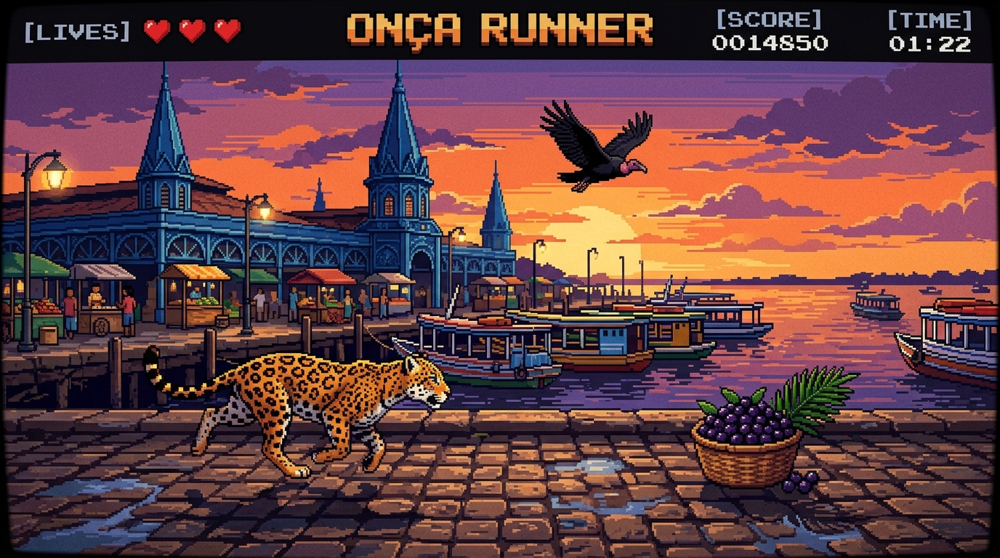

# 🐆 Paidégua Game: A Aventura da Onça em Belém do Pará



> Um jogo de ação arcade retrô-moderno construído 100% em **Go** com **Ebitengine (v2)**, ambientado nos cenários históricos e culturais de **Belém do Pará**.

---

## 🌟 Sobre o Projeto

**Paidégua Game** foi concebido e desenvolvido por **Lucivaldo Junior** em co-criação com o **Nexus AI Ecosystem** (seu time de agentes autônomos de IA, sob liderança técnica de **Lucy - Tech Lead Sênior**). O projeto foi construído do zero com uma proposta didática e profissional: criar um jogo 2D fluido, arquitetado sob as melhores práticas do **Standard Go Project Layout** (`cmd/` e `internal/`), integrando síntese de áudio procedural sem dependência de arquivos externos e física refinada de plataforma.

O protagonista é uma **Onça-Pintada Brasileira** que percorre os cartões postais de Belém do Pará, esquivando-se de obstáculos típicos com saltos acrobáticos, pulo duplo, rugidos felinos e rastejo veloz, tudo ao som de um autêntico **Carimbó Chiptune 8-bit**.

---

## 🎮 Mecânicas & Jogabilidade

| Comando | Ação | Descrição |
| :--- | :--- | :--- |
| `Espaço` ou `Seta para Cima` | **Pulo com Rugido** | A onça salta soltando um rugido felino gutural. Possui **altura variável** (segure para pular mais alto). |
| `Espaço / Cima` (2x no ar) | **Pulo Duplo (*Double Jump*)** | Aciona um segundo impulso potente no ar com rugido duplo e efeito de partículas. |
| `Seta para Baixo` (no chão) | **Abaixar / Rastejar** | Diminui o hitbox pela metade (de 22px para 12px), ideal para passar sob os pássaros. |
| `Seta para Baixo` (no ar) | **Queda Rápida (*Fast Drop*)** | Acelera a descida em direção ao solo para antecipar o próximo movimento. |
| `Enter` ou `Espaço` | **Iniciar / Confirmar Opção / Avançar** | Inicia o jogo na tela inicial, confirma seleções de menu, avança de fase ou reinicia após Game Over. |
| `C` | **Ver Créditos** | Abre a tela de créditos com dados do Desenvolvedor, Linguagem (Go), Engine e Trilha Sonora. |
| `Esc` | **Menu de Pausa Interativo** | Abre o menu com: **Continuar**, **Reiniciar Aventura**, alternar **Som (Mudo / Ligado)**, **Ver Créditos** e **Fechar o Jogo**. |
| `Setas Cima / Baixo` | **Navegação do Menu** | Percorre os itens do Menu de Pausa. |
| `R` | **Recomeçar Rápido** | Reinicia imediatamente a aventura a partir da Fase 1 na tela de conclusão ou Game Over. |

---

## 🏛️ As 3 Fases de Belém do Pará

O jogo possui progressão dinâmica de cenários e metas de conclusão por pontuação:

```text
[ FASE 1: Ver-o-Peso (100 pts) ] ──> [ FASE 2: Estação das Docas (200 pts) ] ──> [ FASE 3: Theatro da Paz (300 pts) ]
```

### 🐟 1. Mercado do Ver-o-Peso (0 a 100 pontos)
* **Cenário:** O crepúsculo alaranjado sobre a **Baía do Guajará**, barcos de madeira tradicionais da Amazônia navegando, o icônico **Mercado de Ferro com cúpulas azuis neogóticas** e calçadão de paralelepípedos.
* **Obstáculos:**
  * 🧺 **Paneiro de Açaí no Chão:** Cesto tradicional trançado com açaí roxo escuro *(Exige PULAR)*.
  * 🦅 **Urubu do Ver-o-Peso no Ar:** O pássaro clássico do mercado do peixe voando a meia altura *(Exige ABAIXAR)*.

### ⚓ 2. Estação das Docas (101 a 200 pontos)
* **Cenário:** Os emblemáticos **galpões ingleses de ferro vermelho**, os imponentes **guindastes portuários amarelos** na beira do cais e o piso em deck de madeira.
* **Obstáculos:**
  * 🪵 **Barril de Carvalho/Cerveja das Docas:** Barril rústico com aros dourados no chão *(Exige PULAR)*.
  * 🕊️ **Gaivota Fluvial:** Pássaro branco com pontas pretas voando sobre a orla *(Exige ABAIXAR)*.

### 🎭 3. Theatro da Paz & Mangueiras (201 a 300 pontos - Vitória Final!)
* **Cenário:** A imponente fachada neoclássica do **Theatro da Paz**, as frondosas **Mangueiras centenárias de Belém** repletas de mangas amarelas e a clássica **calçada de pedras portuguesas geométricas**.
* **Obstáculos:**
  * 🥭 **Cesto de Mangas Caídas:** Frutas maduras espalhadas no solo *(Exige PULAR)*.
  * 🦜 **Maritaca Verde:** Ave veloz cruzando as copas da Praça da República *(Exige ABAIXAR)*.

---

## 🏗️ Arquitetura do Software (Standard Go Layout)

O projeto foi estruturado seguindo rigorosamente os padrões corporativos de engenharia de software em Go:

```text
paidegua-game/
├── cmd/
│   └── runner/
│       └── main.go              # Entrypoint oficial da aplicação (< 15 linhas)
├── internal/                    # Módulos privados protegidos pelo compilador Go
│   ├── audio/
│   │   └── audio.go             # Sintetizador procedural de Carimbó BGM e Rugido Felino
│   ├── entities/
│   │   ├── onca.go              # Anatomia, ciclo de galope em 4 fases, partículas e física
│   │   └── obstacle.go          # Gerador procedural de obstáculos terrestres e aéreos
│   ├── scenery/
│   │   └── ver_o_peso.go        # Renderização em camadas e paralaxe dos 3 pontos turísticos
│   ├── ui/
│   │   └── hud.go               # HUD de corações em pixel art, score, telas de pausa e vitória
│   └── game/
│       └── game.go              # Game Loop (Update, Draw, Layout do Ebitengine)
├── assets/
│   ├── gameplay.jpg             # Mockup visual do jogo
│   └── ver_o_peso_bg.jpg        # Background panorâmico em pixel art
├── GUIA_APRENDIZADO.md          # Guia técnico passo a passo completo
├── main.go                      # Wrapper na raiz para execução rápida
├── go.mod                       # Módulo Go (github.com/luci-jr/paidegua-game)
└── go.sum                       # Checksums das bibliotecas
```

### Por que essa estrutura?
* **Encapsulamento com `internal/`:** O compilador do Go proíbe qualquer importação externa de código localizado em `internal/`, garantindo que regras de negócio não vazem.
* **`cmd/` Enxuto (*Thin Main*):** O ponto de entrada apenas inicializa as configurações e dispara o loop, sem acoplamento de lógica.

---

## 🎵 Síntese de Áudio Procedural (Zero Arquivos Externos)

Ao invés de carregar arquivos `.wav` ou `.mp3` pesados, todos os efeitos e músicas são **sintetizados matematicamente em tempo real** diretamente na memória:

1. **Trilha de Carimbó (BGM):**
   * Curimbó grave (82Hz) e repiques de aro sincopados.
   * Melodia aveludada em ondas senoidais estilo marimba/flauta em loop contínuo via `audio.NewInfiniteLoop`.
   * Sem ruídos estridentes, com mixagem suave de fundo.
2. **Rugido Felino da Onça (*Feline Roar*):**
   * Sintetizado com frequência base grave (85Hz a 110Hz) modulada por tremolo de garganta (38Hz) e respiração felina.
3. **Impacto e Danos:**
   * Punch grave com decaimento exponencial suave.

---

## 💻 Como Rodar o Projeto

### Pré-requisitos
* **Go** versão 1.22 ou superior instalada.

### Execução Imediata
Abra o terminal na pasta do projeto e rode:

```bash
# Opção 1: Execução direta pela raiz
go run main.go

# Opção 2: Execução pelo ponto de entrada oficial
go run ./cmd/runner
```

### Compilar o Binário Nativo
Para gerar o executável autônomo do jogo:

```bash
go build -o paidegua-game ./cmd/runner
./paidegua-game
```

---

## 🧠 Conceitos de Engenharia de Software Aplicados

* **State Machine & Physics:** Gravidade parabólica, Coyote Time, Jump Buffering e corte de velocidade vertical no release do botão.
* **AABB Collision Detection:** Algoritmo matemático de sobreposição de retângulos alinhados aos eixos com caixas de colisão dinâmicas.
* **Particle System:** Sistema enxuto de partículas com reciclagem de memória para poeira de aterrissagem e rastejo.
* **Ebitengine Loop:** Separação estrita entre simulação física determinística a 60 ticks por segundo (`Update`) e renderização em camadas (`Draw`).

---

## 👥 Autoria & Créditos

* **Desenvolvedor:** **Lucivaldo Junior** (Luci Junior)
* **Co-criação & Squad de IA:** **Nexus AI Ecosystem** — Sistema autônomo de múltiplos agentes de Inteligência Artificial idealizado e desenvolvido por **Lucivaldo Junior**, atuando sob a liderança técnica e arquitetura de **Lucy (Tech Lead & Arquiteta do Ecossistema)**.
* **Linguagem:** Go (Golang 1.22+)
* **Game Engine:** [Ebitengine (v2)](https://ebitengine.org/)
* **Síntese de Áudio:** Síntese procedural em tempo real (Carimbó BGM e Rugido Felino).
* **Temática Cultural:** Belém do Pará, Amazônia, Brasil.
