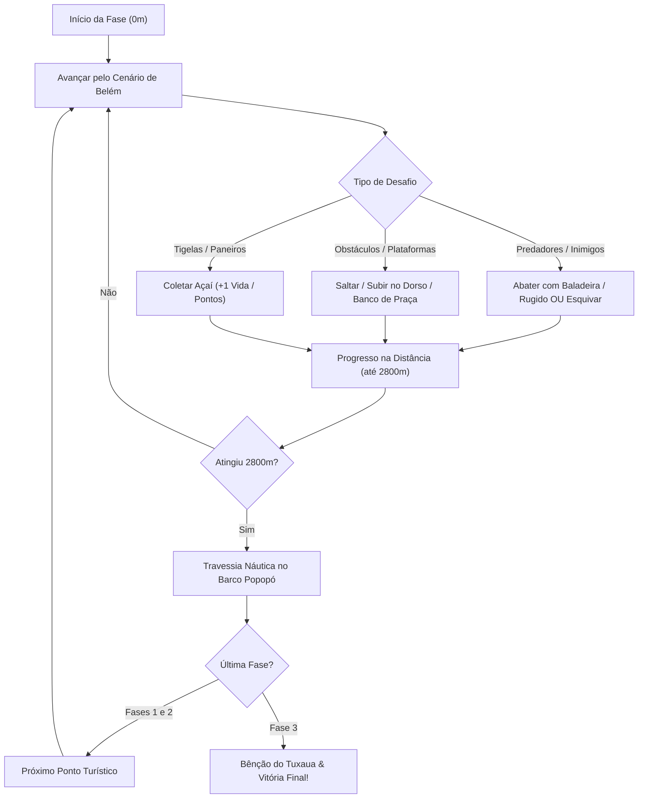

# 📜 Game Design Document (GDD) — PaiD'Egua Runner

> **Versão do Documento:** 1.0.0  
> **Status:** Vivo / Produção (VER. 2.4.0)  
> **Última Atualização:** 12 de Setembro de 2026  
> **Autor & Engenheiro Responsável:** Lucivaldo Junior ([@luci-jr](https://github.com/luci-jr))  
> **Repositório Oficial:** [github.com/luci-jr/paidegua-runner](https://github.com/luci-jr/paidegua-runner)  
> **Deploy de Produção (WebAssembly):** [luci-jr.github.io/paidegua-runner](https://luci-jr.github.io/paidegua-runner/)  

---

## 1. 🎯 Resumo Executivo & High Concept

### 1.1. One-Sentence Pitch
> *Um jogo de aventura e plataforma arcade 16-bit de alta precisão ambientado nos cartões-postais históricos de Belém do Pará, desenvolvido 100% em Go com Ebitengine e áudio procedural chiptune.*

### 1.2. Ficha Técnica
| Atributo | Especificação |
| :--- | :--- |
| **Título Oficial** | **PaiD'Egua Runner: Uma Aventura em Belém do Pará** |
| **Gênero** | Plataforma de Ação / Runner Arcade 2D |
| **Público-Alvo** | Jovens, adultos e entusiastas de jogos retro anos 90 (*SNES / Arcade / Mega Drive*) |
| **Classificação Indicativa**| Livre (E - Everyone) |
| **Plataformas-Alvo** | Web (WebAssembly via navegadores Desktop e Mobile) e Desktop Nativo (Linux, macOS, Windows) |
| **Motor Gráfico & Linguagem** | [Ebitengine v2](https://ebitengine.org/) sobre **Go 1.22+** |
| **Arquitetura de Áudio** | Síntese de Áudio Procedural Chiptune 8-Bit (Arquitetura Ricoh 2A03 / NES em memória) |
| **Inspirações Principais** | *Pitfall: The Mayan Adventure* (1994), *Donkey Kong Country*, *Sonic The Hedgehog* e cultura amazônica paraense. |

---

## 2. 🏛️ Pilares de Design (Design Pillars)

1. **Autenticidade Cultural Viva:**  
   Cada elemento do jogo — cenários, sonoplastia, obstáculos, itens e diálogos — respira a identidade de Belém do Pará (Ver-o-Peso, Baía do Guajará, Estação das Docas, Theatro da Paz, Carimbó, Açaí e expressões regionais).
2. **Jogabilidade Retro Precisa & Dinâmica:**  
   Física de corrida clássica não-automática: o jogador controla o avanço do mundo através da movimentação do herói, com pulo de altura variável, pulo duplo, charge shot e aterrissagem em plataformas sólidas (*ledge landing*).
3. **Engenharia de Software de Alto Desempenho:**  
   Zero dependência de arquivos externos pesados de mídia (sem MP3s de megabytes ou assets volumosos). Renderização eficiente em 60 FPS, compilação cruzada para WebAssembly leve e execução nativa sem gargalos de memória.

---

## 3. 🔄 Core Game Loop



* **Loop de Segundo a Segundo:** Deslocar-se horizontalmente, avaliar a distância de predadores (jacarés, cobras, urubus), alternar entre esquiva acrobática e disparos balísticos, e aterrissar em plataformas estratégicas.
* **Loop de Minuto a Minuto:** Gerenciar corações e vidas, manter o ritmo constante da corrida ao longo dos 2800 metros de cada cartão-postal e desfrutar das transições narrativas no barco regional Popopó.
* **Loop de Sessão:** Escolher o herói (Garoto Curumim ou Onça-Pintada), ajustar o ritmo de jogo (Calmo, Normal, Rápido, Turbo) e zerar as 3 fases alcançando o recorde histórico (*High Score*).

---

## 4. 👥 Personagens Jogáveis

O jogador escolhe entre dois heróis emblemáticos com características complementares:

```
        🏹 GAROTO CURUMIM                     🐆 ONÇA-PINTADA
   [ Combate Balístico à Distância ]       [ Velocidade & Força de Impacto ]
   - Baladeira de Açaí (Anti-aérea)        - Rugido Sônico Dourado
   - Super Caroço Dourado (Charge)         - Mega Rugido Alfa Titânico (Charge)
   - Salto acrobático leve                 - Passadas 2.4x mais rápidas
```

### 4.1. Tabela Comparativa de Atributos

| Atributo / Habilidade | 🏹 Garoto Curumim | 🐆 Onça-Pintada |
| :--- | :--- | :--- |
| **Estilo de Gameplay** | Tático / Combate à Distância | Agressivo / Rush Veloz |
| **Arma Primária** | Baladeira de madeira (sementes de açaí) | Rugido Sônico Acústico concêntrico |
| **Ângulos de Tiro** | Frontal e Anti-Aéreo vertical (`↑`) | Onda frontal de choque expandida |
| **Ataque Carregado (*Charge*)** | **Super Caroço de Açaí Dourado** (perfura 2 alvos) | **Mega Rugido Alfa Titânico** (perfura 3 alvos) |
| **Mobilidade de Solo** | Ritmo padrão dinâmico | Passadas ágeis alargadas (`2.4x`) |
| **Habilidade Aérea** | Pulo duplo acrobático com cambalhota | Bote felino alongado no ar |
| **Defesa / Hitbox** | Reduzida ao agachar (`↓`) | Perfil baixo natural com bote rente ao chão |
| **Bordão Regional** | *"Bora lá maninho!"* | *"RRRAUW! Rainha da Selva!"* |

---

## 5. 🕹️ Controles & Esquema de Entrada

O jogo suporta simultaneamente **Teclado (PC)**, **Controles Virtuais Touch (Mobile)** e **Gamepads**:

| Ação | Teclado (PC) | Toque (Mobile) | Efeito no Jogo |
| :--- | :--- | :--- | :--- |
| **Confirmar / Iniciar** | `Enter` | Toque na tela | Inicia a partida ou avança menus. |
| **Avançar** | `D` ou `Seta Direita` | Botão `►` | Move o herói para a frente e avança o scroll do cenário. |
| **Recuar** | `A` ou `Seta Esquerda` | Botão `◄` | Recua o herói para trás para recompor espaço de mira. |
| **Salto com Altura Variável** | `W` ou `Seta Cima` | Botão `▲ PULO` | Impulso físico parabólico; altura varia com a pressão. |
| **Pulo Duplo (*Double Jump*)** | `W` no ar (2x) | Tocar `▲` no ar | Segundo impulso acrobático ou bote felino. |
| **Ataque Rápido** | `Espaço`, `X` ou `J` | Botão `🎯 ATAQUE` | Disparo com cooldown anti-spam de 18 frames (~0.3s). |
| **Tiro Especial (*Charge*)** | Segurar ataque (~0.7s) | Segurar `🎯` | Canaliza faíscas e dispara projétil massivo perfurante. |
| **Mira Anti-Aérea** | `W` + Ataque (em pé) | Mirar para cima | Projétil direcionado a 90° contra aves no céu. |
| **Abaixar / Rastejar** | `S` ou `Seta Baixo` | Botão `▼ BAIXO` | Reduz a hitbox vertical pela metade para esquiva. |
| **Queda Rápida (*Fast Drop*)** | `S` durante o salto | Botão `▼` no ar | Cancela a sustentação aérea e acelera o retorno ao solo. |
| **Menu de Pausa** | `Esc` | Botão `⏸ PAUSA` | Abre o menu de configurações em tempo real. |

---

## 6. ⚙️ Mecânicas & Regras do Sistema

### 6.1. Sistema de Sobrevivência (3 Vidas × 3 Corações)
* **Vidas:** O jogador inicia com **3 Vidas** completas (`x3 VIDAS`).
* **Corações:** Cada vida é composta por **3 Corações** de energia vital.
* **Tolerância a Erros:** O herói suporta até 9 colisões com predadores ao longo da run antes do Game Over definitivo.
* **Hitstop & Invencibilidade Temporária (*i-frames*):**
  * Ao sofrer dano, o jogo congela por breves milissegundos (*hitstop*) para impacto tátil.
  * O herói pisca em transparência durante 60 frames com invulnerabilidade total a novos impactos.

### 6.2. Câmera & Scroll Direcional Não-Automático
Diferente de runners automáticos convencionais, a câmera do *PaiD'Egua Runner* prioriza o controle do jogador:
* **Parado (`Idle`):** O scroll da câmera é nulo ($v = 0$). O herói não é empurrado para a morte pelo canto da tela.
* **Avançando:** Ao ultrapassar o limiar de avanço (`cameraForwardLimit = 135px`), a câmera acompanha progressivamente a velocidade do herói, rolando o parallax do cenário e acumulando a distância da fase.
* **Recuando:** Ao aproximar-se do limiar traseiro (`cameraBackLimit = 45px`), a câmera retrocede suavemente o cenário.

### 6.3. Plataformas Sólidas & Ledge Landing (*Mecânica Pitfall*)
* **Aterrissagem Superior:** Ao cair sobre o topo de obstáculos sólidos — **Paneiro de Açaí** (`TypeGround`) ou o dorso do **Jacaré-Açu** (`TypeJacare`) — com velocidade vertical descendente (`playerVY >= -1.0`), o personagem **não sofre dano frontal**.
* **Montaria & Suporte:** O herói aterrissa no topo (`GroundOffset = -obs.Height`), podendo caminhar sobre o obstáculo, atirar de posição elevada ou saltar mais alto.
* **Queda Gravitacional:** Ao sair dos limites horizontais do obstáculo, o herói entra em queda livre natural até o piso da rua.

### 6.4. O Papel Cultural do Açaí (Inofensivo & Vital)
Alinhado à cultura alimentar paraense:
* O Paneiro de Açaí **nunca fere o jogador**.
* Tocar no Paneiro de Açaí ou coletar a Tigela de Açaí com Farinha de Tapioca (`RelicAcaiBowl`) recupera **+1 Coração de Vida**.
* Caso a vida já esteja cheia (3 corações), o jogador é bonificado com o bônus **ACAI POWER! (+100/+150 pts)**.

---

## 7. 👾 Bestiário, Obstáculos e Itens

```
     🐊 JACARÉ-AÇU                🐍 COBRA-CORAL               🦅 AVES AMAZÔNICAS
[ Réptil com Ledge Landing ]     [ Rápida e Rasteira ]         [ Voo a Meia Altura ]
HP: 2 | Dano: 1 Coração          HP: 1 | Dano: 1 Coração       HP: 1 | Dano: 1 Coração
```

| Entidade | Categoria | Comportamento / Movimentação | HP | Como Superar | Recompensa |
| :--- | :--- | :--- | :--- | :--- | :--- |
| **🐊 Jacaré-Açu** | Predador Terrestre | Rasteja a `0.35 px/frame`. Dorso sólido serve de degrau. | 2 | Pular sobre o dorso OU 2 tiros normais / 1 Tiro Carregado. | +60 pts |
| **🐍 Cobra-Coral** | Predador Terrestre | Deslocamento veloz e ondulante no solo a `0.50 px/frame`. | 1 | Salto parabólico simples OU 1 tiro de baladeira/rugido. | +50 pts |
| **🦅 Urubu / Gaivota** | Ameaça Aérea | Voo horizontal rasante a `0.70 px/frame`. | 1 | Agachar (`↓`) para esquiva OU Disparo vertical (`↑ + Tiro`). | +50 pts |
| **🧺 Paneiro de Açaí** | Elemento Cultural | Fixo no piso. Plataforma sólida inofensiva. | - | Subir no topo para alcançar altura ou encostar. | +1 Coração ou +100 pts |
| **🪵 Banco de Praça** | Refúgio Urbano | Banco de madeira colonial verde. Imune a danos. | - | Subir para escapar de jacarés e cobras no solo. | Plataforma Segura |
| **🥣 Tigela de Açaí** | Relíquia de Cura | Item flutuante com cuia tradicional de açaí e tapioca. | - | Coletar passando por cima. | +1 Coração (+150 pts bônus) |

---

## 8. 🗺️ Level Design & Progressão dos Cenários

A jornada é estruturada em **3 Fases de 2800 metros** cada, totalizando 8400 metros de travessia cultural:

```text
[ FASE 1: Ver-o-Peso ] ──> [ Barco Popopó ] ──> [ FASE 2: Estação das Docas ] ──> [ Barco Popopó ] ──> [ FASE 3: Theatro da Paz ]
     (2800 metros)             (Travessia)               (2800 metros)             (Travessia)                (2800 metros)
```

### 8.1. Fase 1: Mercado do Ver-o-Peso (0 a 2800m)
* **Ambiente:** Cais de pedras de cantaria histórica banhado pela Baía do Guajará ao entardecer, com o Mercado de Ferro neoclássico e seus torreões azuis ao fundo.
* **Desafios:** Introdução dos paneiros de açaí, urubus sobrevoando as docas de peixe e primeiros jacarés que sobem da maré.
* **Piso:** Cais de cantaria centenária com reflexos da água.

### 8.2. Tela Náutica de Transição: O Barco Popopó
* **Narrativa Intermediária:** Entre as fases, o jogador embarca no tradicional "Popopó" de madeira cortando as ondas da Baía do Guajará.
* **Efeitos Visuais:** Fumaça pixel art animada, transição em fade-in/fade-out cinematográfico e letreiro cultural com fatos históricos sobre o próximo destino.

### 8.3. Fase 2: Estação das Docas (0 a 2800m)
* **Ambiente:** Galpões portuários de ferro inglês pintados de vermelho colonial, guindastes históricos amarelos e brisa da baía.
* **Desafios:** Maior densidade de predadores, gaivotas rasantes velozes e alternância entre bancos coloniais e caixotes.
* **Piso:** Deck contínuo de madeira de lei com trilhos ferroviários ingleses de 1897.

### 8.4. Fase 3: Theatro da Paz & Praça da República (0 a 2800m — Grande Final)
* **Ambiente:** A imponência neoclássica do Theatro da Paz (1878), mangueiras centenárias carregadas de frutos e atmosfera da Belle Époque amazônica.
* **Desafios:** Desafio máximo de reflexos; ataques aéreos coordenados com cobras-corais rápidas e sucessão de obstáculos.
* **Piso:** Mosaico tradicional de pedras portuguesas onduladas ladeado por canteiros verdes.
* **Clímax & Encerramento:** Ao cruzar a marca de 2800m, o **Guerreiro Indígena Tuxaua** surge em pixel art majestoso com cocar de arara para abençoar o herói com a tela triunfal de vitória!

---

## 9. 🎨 Direção de Arte & Interface (UI/UX)

```
┌──────────────────────────────────────────────────────────────┐
│ 1UP 012400   ★ HIGH 050000 ★       x3 GAROTO   ❤️❤️❤️  x3 VIDAS │
│ DIST: 1450m / 2800m                     VEL: 0.8x [NORMAL]   │
│                                                              │
│                      [ ÁREA DE JOGO ]                        │
│                                                              │
│ ──────────────────────────────────────────────────────────── │
│ 🏛️ CURIOSIDADE: O Mercado de Ferro foi importado em 1899...   │
└──────────────────────────────────────────────────────────────┘
```

### 9.1. Identidade Visual 16-Bit Arcade
* **Paleta de Cores:** Dithering calibrado em paleta retro inspirada na floresta e arquitetura paraense (verde sumaúma, amarelo açaí-ouro, vermelho cerâmica marajoara e azul crepúsculo da baía).
* **Logotipo Arcade 3D:** Tipografia em relevo esculpido com bisel specular, faixas escarlates com rebites de ouro e ornamentos geométricos da cerâmica marajoara ancestral.
* **Efeitos de Imersão:** Scanlines CRT arcade sutis, tochas animadas com partículas de calor flutuante e reflexos ondulantes na água.

### 9.2. HUD de Gameplay
* **Score & High Score:** Marcadores clássicos no topo superior esquerdo (`1UP` e `HIGH`).
* **Status do Herói:** Identificação visual do protagonista ativo, corações vermelhos de vida e vidas restantes.
* **Telemetria de Fase:** Odômetro de corrida em tempo real (`DIST: Xm / 2800m`) e indicador do perfil de velocidade.
* **Letreiro Cultural Inferior:** Curiosidades históricas e ecológicas rotativas sobre Belém durante a corrida.

---

## 10. 🎵 Arquitetura Sonora (8-Bit Chiptune Autoral)

O jogo utiliza um motor sonoro sintetizado em tempo real via código Go (sem consumo de arquivos externos):

```text
┌────────────────────────────────────────────────────────────────────────┐
│                   MOTOR DE SÍNTESE PROCEDURAL GO                      │
│                                                                        │
│ ┌──────────────────────┐   ┌──────────────────────┐                    │
│ │ Canal Pulse 1 (50%)  │   │ Canal Pulse 2 (25%)  │                    │
│ │ Melodia de Carimbó   │   │ Guitarrada Paraense  │                    │
│ └──────────┬───────────┘   └──────────┬───────────┘                    │
│            │                          │                                │
│            ▼                          ▼                                │
│ ┌──────────────────────┐   ┌──────────────────────┐    ┌─────────────┐ │
│ │ Canal Triangle       │   │ Canal Noise (4-bit)  │───►│ MIXER FINAL │ │
│ │ Baixo Tumbao (82Hz)  │   │ Curimbó & Maracas    │    │ ESTÉREO PCM │ │
│ └──────────────────────┘   └──────────────────────┘    └─────────────┘ │
└────────────────────────────────────────────────────────────────────────┘
```

1. **Pulse 1 (Square Wave 50%):** Conduz as frases melódicas dançantes e contagiantes do Carimbó paraense com vibrato suave.
2. **Pulse 2 (Square Wave 25%):** Executa o contra-canto sincopado com técnica de *staccato*, emulando a clássica Guitarrada de Mestre Vieira.
3. **Triangle Wave:** Gera a linha de contrabaixo encorpada em ondas triangulares, marcando o balanço suingado do tumbao amazônico.
4. **Noise Channel (DAC 4-Bit com Pitch Drop):** Emula a percussão rítmica com queda rápida de frequência (155Hz $\to$ 45Hz), sintetizando o estrondo do tradicional tambor Curimbó paraense e as maracas de sementes.
5. **Efeitos Sonoros (SFX):** Disparo estalado da baladeira, rugido da onça por modulação de frequência, e explosão de partículas na eliminação de inimigos.

---

## 11. 💻 Especificações Técnicas & Engenharia

### 11.1. Arquitetura de Pastas (Standard Go Project Layout)
```text
paidegua-runner/
├── cmd/runner/main.go       # Ponto de entrada enxuto (< 20 linhas)
├── internal/
│   ├── audio/audio.go       # Sintetizador procedural chiptune e mixer PCM
│   ├── entities/            # Garoto, Onça, Projéteis, Inimigos e Relíquias
│   ├── scenery/             # Motor de renderização parallax em camadas
│   ├── ui/hud.go            # Logotipo arcade, menus, HUD e telas intermediárias
│   └── game/                # Game loop, colisões, física e tags de compilação
├── docs/                    # Pipeline de deploy WebAssembly (GitHub Pages)
│   ├── index.html           # Canvas responsivo com touch overlay
│   ├── game.wasm            # Binário compilado de alta eficiência
│   └── GDD.md               # Este documento de especificação
└── README.md                # Manual público do repositório
```

### 11.2. Build & Pipelines de Entrega
* **WebAssembly (Produção):**
  ```bash
  GOOS=js GOARCH=wasm go build -trimpath -ldflags="-s -w" -o docs/game.wasm ./cmd/runner
  ```
* **Desktop Nativo (Desenvolvimento & Testes de Carga):**
  ```bash
  go run ./cmd/runner
  ```

---

## 12. 🚀 Roadmap de Evolução & Backlog Futuro

- [x] **v1.0 - Protótipo Fundamental:** Física de corrida, pulo e primeiro cenário.
- [x] **v2.0 - Identidade de Belém & 3 Fases:** Inclusão de Ver-o-Peso, Docas e Theatro da Paz.
- [x] **v2.2 - Protagonistas & Combate:** Garoto com baladeira e Onça-Pintada com rugido sônico.
- [x] **v2.3 - Plataformas Pitfall:** Ledge landing em jacarés, bancos de praça e paneiros inofensivos.
- [x] **v2.4 - Áudio Autoral & Logotipo Arcade:** Trilha procedural chiptune 8-bit e arte arcade imponente.
- [ ] **v2.5 - Suporte a Leaderboard Global:** Tabela online de pontuações via API Go/Redis no backend.
- [ ] **v2.6 - Conquistas Regionais (*Achievements*):** Medalhas temáticas (ex: *"Mestre do Curimbó"*, *"Guardião da Baía"*).
